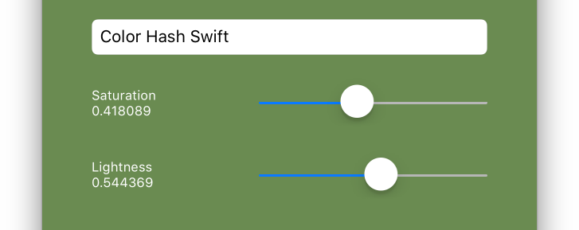

# Color Hash Swift

This is a Swift port of [Color Hash](https://github.com/zenozeng/color-hash).

```swift
let str = "こんにちは、世界"
let saturation = 0.30
let lightness = 0.70

ColorHash(str, [CGFloat(saturation)], [CGFloat(lightness)]).color
```


