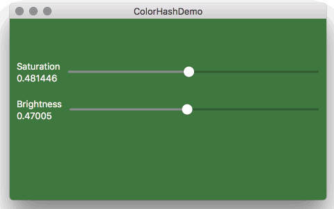

# Color Hash Swift

This is a Swift port of [Color Hash](https://github.com/zenozeng/color-hash).

Generates `UIColor` and `NSColor` from given string.

```swift
import ColorHash

let str = "こんにちは、世界"
let saturation: CGFloat = 0.30
let lightness: CGFloat = 0.70

ColorHash(str, [saturation], [lightness]).color
```



Install
-------

### CocoaPods

```rb
pod 'ColorHash'
```

### Carthage

```rb
github 'ngs/color-hash.swift'
```


Author
------

[Atsushi NAGASE](http://ngs.io)

License
-------

See [LICENSE](./LICENSE)
